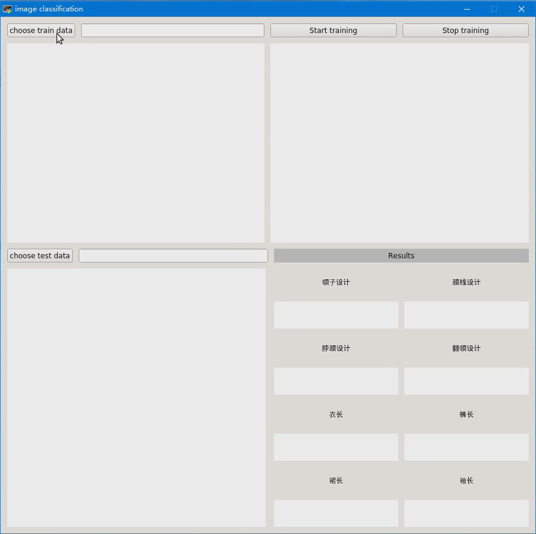
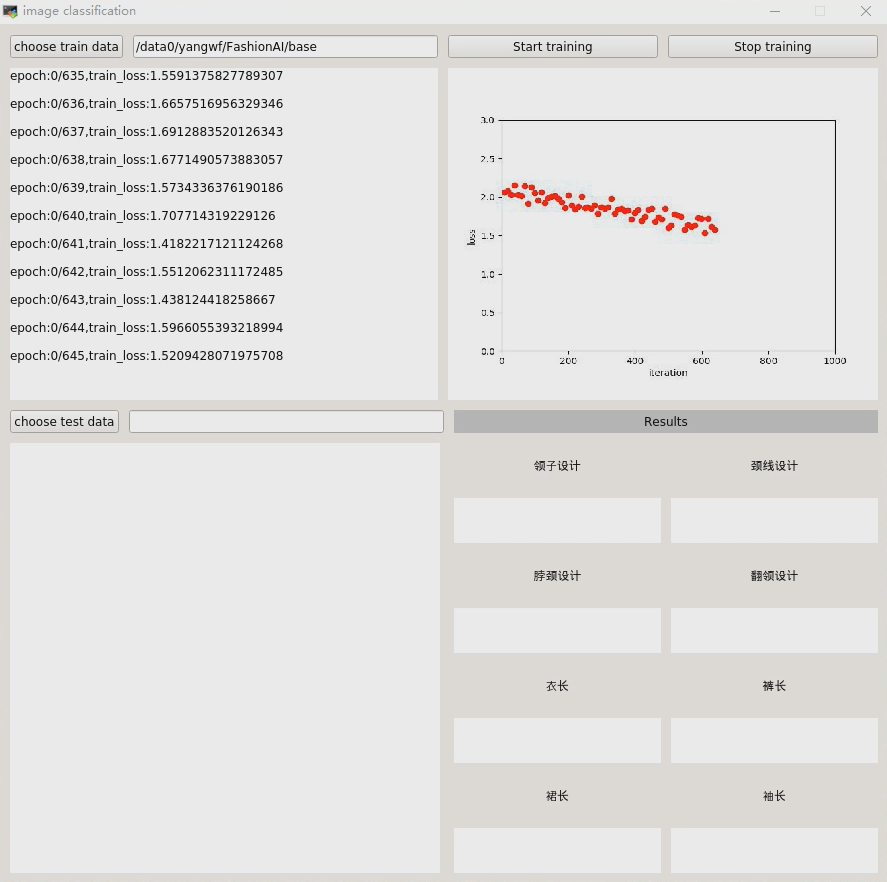
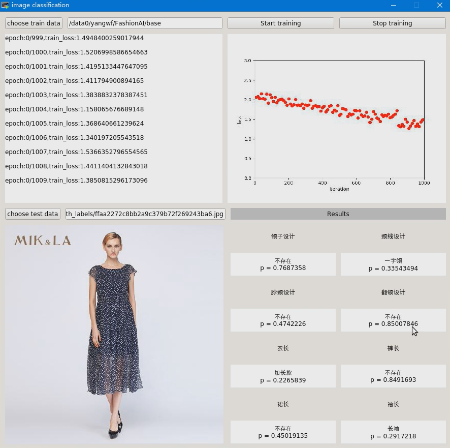

## Description:
* this project is written by PyCharm Community 2017
* and it's the course project of Pattern Recognition opened in USTC by Zengfu Wang
* folder *./buffer* contains some cache files for this project
* folder *./models* contains the cnn model definition files
* folder *./ utils* contains some functions and classes definition
* folder *./weights* contains the trained model by ourseclves
## Dependencies:
* python: anaconda 3.6 (some pre-versions of anaconda may scupport)
* libraries: PyQt5, torch, torchvision, as well as some other common libraries 
## Usage:
**Run main_ui.py to launch the UI**

### 1. train
* press button *choose traicn data* to choose the directory of training data.
* Noted that our cnn model was trained for FashionAI challenge hold by Alibaba, and you can click this [link](https://tianchi.aliyun.com/competition/introduction.htm?spm=5176.100066.0.0.6529d7804HqC0a&raceId=231649) for more information about the data.
* press button *Star training* to train the cnn
* press button *Stop* to stop the training process

### 2. test
* press button *choose test data* to choose one image to test, then the test image and results will be shown in the UI. 
* Noted that ur cnn model was trained for FashionAI challenge opened by Alibaba, and you can click this [link](https://tianchi.aliyun.com/competition/introduction.htm?spm=5176.100066.0.0.6529d7804HqC0a&raceId=231649) for more information about the results required for this challenge.
